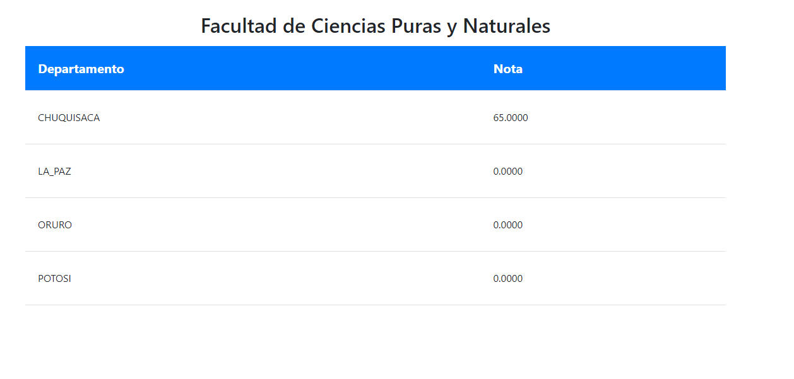

# Primer Examen

# Preguntas
Cree la tabla USUARIO en la base de datos MIBASEMINOMBRE, la cual contiene información de CI, Usuario, Password y otra tabla PERSONA con CI, Nombre completo, fecha de nacimiento, telefono (codigo largo que incluye codigo de pais ej: (591)75757575 ),departamento (código de 2 dígitos según INE); asimismo la tabla INSCRIPCION con CIestudiante, Sigla, nota1, nota2, nota3, notafinal.

Realice lo siguiente:

1. Genere una pantalla con templates (CSS y PHP) debidamente maquetado de acceso a la facultad y al menos tres carreras (de los templates existentes en la web)  

2. Genere una pantalla con templates (CSS y ASP.NET) debidamente maquetado de acceso a la facultad y al menos tres carreras (de los templates existentes en la web)

3. Genere una pantalla de acceso (CSS y PHP) con la base de datos, controlando en las demás pantallas mediante sesiones.

4. Con el rol DIRECTOR se puede visualizar por departamento la media de notas, usando ASP.NET (SQL con case-when) bajando la consulta en un array (similar al case-when, pero sin usar estos).

5. Con el rol DIRECTOR se puede visualizar por departamento la media de notas, con PHP (case-when).

6. Implemente las altas, bajas y cambios de la tabla PERSONA mediente Codeigniter.

7. Implemente un WEB SERVICE en VISUAL STUDIO que permita altas, bajas y cambios en PERSONA, usando la misma en aplicación WindowsForm.

9. Implemente un Micro Servicios sobre USUARIOS con PHP que permita altas, bajas y cambios en PERSONA

Cada pregunta debe ser almacenada en Github, la misma permitir su acceso mínimamente a msilva@fcpn.edu.bo. Adjuntar el link por pregunta en un PDF o Word y enviarlo para su revisión.

