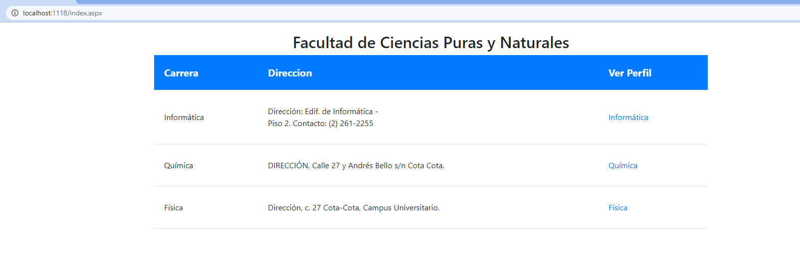
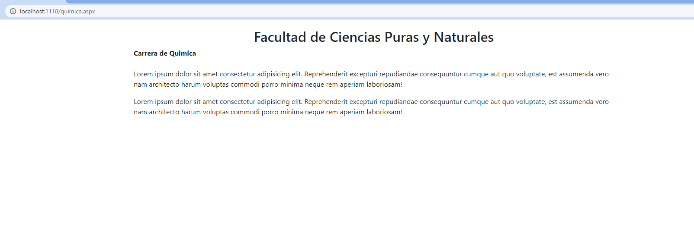

# Primer Examen

# Preguntas
Cree la tabla USUARIO en la base de datos MIBASEMINOMBRE, la cual contiene información de CI, Usuario, Password y otra tabla PERSONA con CI, Nombre completo, fecha de nacimiento, telefono (codigo largo que incluye codigo de pais ej: (591)75757575 ),departamento (código de 2 dígitos según INE); asimismo la tabla INSCRIPCION con CIestudiante, Sigla, nota1, nota2, nota3, notafinal.

Realice lo siguiente:

2. Genere una pantalla con templates (CSS y ASP.NET) debidamente maquetado de acceso a la facultad y al menos tres carreras (de los templates existentes en la web)

